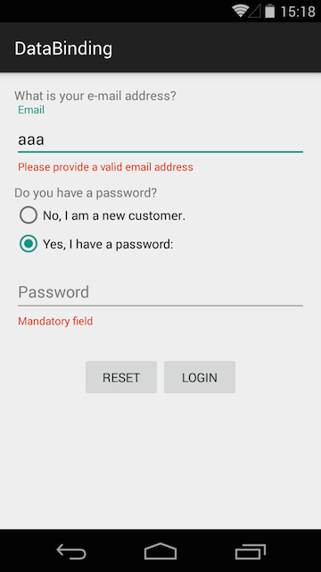

本篇译文的原文发表在15年12月份，当时的安卓数据绑定库仍然处于Beta版本，对于一些支持不好，但是仍然有许多人不断探索该库。本篇博客相较于之前笔者翻译的Android Data Binding一系列的文章是一个进阶型的文章，暂且把标题定为Android Data Binding 高级系列之xxx。

本篇译文是高级系列的第一篇：安卓双向数据绑定
**注意：**之所以实现双向数据绑定，*Observable*功不可没，本篇博文发表时还尚不支持对象序列化，故原作者使用[Parceler](http://parceler.org/)库。译者也对本文中的例子亲自用代码实现了一遍并且使用最新的数据绑定库是支持对象序列化的，在代码编写过程中发现数据绑定库仍然不够完善，对一些泛型类在自定义的绑定中支持不好。所以，还是期待谷歌工程师继续努力将其完善的更好。

> [@fabioCollini](https://github.com/fabioCollini)
> **原文地址：**[https://medium.com/@fabioCollini/android-data-binding-f9f9d3afc761#.x887xhvrl](https://medium.com/@fabioCollini/android-data-binding-f9f9d3afc761#.x887xhvrl)


自从2015谷歌IO大会发布安卓数据绑定库以来，它就一直受到开发者的关注，也一直是大家讨论话题。好了，现在是时候写点例子来探讨下该库了。

在[谷歌官方文档](https://developer.android.com/tools/data-binding/guide.html)和网上大部分关于Data Binding的文章中，也都有例子可寻,但是大多数的例子都停留在介绍该库最基本的特性使用上。当然这也是该库的魅力所在，能吸引到很多开发者的青睐，肯定有它的原因的。本篇博客我们将从两个例子开始说起（一个稍微简单另外一个就复杂的多），通过例子我们来解读为什么它如此受欢迎。

**更新:**随着AndroidStudio2.1 alpha3的发布，官方支持了[双向数据绑定](https://halfthought.wordpress.com/2016/03/23/2-way-data-binding-on-android/)。对于本文中的例子虽然还可以使用，但是已经被官方弃用了。你需要使用官方提供的方法。

**译者注：**译者将对该文进行代码编写并且使用最新的官方提供的API

# 在控件文本域上进行双向数据绑定
Echo是一个典型的数据绑定例子：将同一个java bean绑定到两个控件的文本域上。它的功能是允许我们在其中一个控件上改变文本域的内容同时也要实时更新另外一个控件文本域的内容。为了实现这个例子，我们先从Java bean写起：

```java
public class Echo {
    public String text;
}
```


为了方便起见，这里不安JavaBean的严格规范书写，所以省去了setxxx和getxxx方法。

布局文件也很简单，由两个EditText组成：

```xml
<layout 
  xmlns:android="http://schemas.android.com/apk/res/android"
  xmlns:tools="http://schemas.android.com/tools">
  <data>
    <variable
      name="echo"
      type="it.cosenonjaviste.databinding.echo.Echo"/>
  </data>
  <LinearLayout
    android:layout_width="match_parent"
    android:layout_height="match_parent"
    android:orientation="vertical"
    android:padding="16dp">
    <EditText
      android:layout_width="match_parent"
      android:layout_height="wrap_content"
      android:hint="Text 1"
      android:text="@{echo.text}"/>
    <EditText
      android:layout_width="match_parent"
      android:layout_height="wrap_content"
      android:hint="Text 2"
      android:text="@{echo.text}"/>
  </LinearLayout>
</layout>
```


在Activity中只需要使用**DataBindingUtil**类来设置布局，然后为它设置要绑定的变量（EchoBinding类是数据绑定库自动生成的）：

```java
public class EchoActivity extends AppCompatActivity {
  @Override 
  protected void onCreate(Bundle savedInstanceState) {
    super.onCreate(savedInstanceState);
    EchoBinding binding = DataBindingUtil.setContentView(
      this, R.layout.echo);
    binding.setEcho(new Echo());
  }
}
```


好了，在理想状态下，只要在控件上设置正确的监听器，就可以实现实时更新了，但是实际情况呢，只要是不设置监听器文本域是不会自动更新另外一个的。将Echo绑定在两个文本域上，当在EchoBinding对象中调用setEcho方法时如果echo不为空，那么它就会被设置在两个文本域控件上。绑定工作是从java对象到布局控件的一个流程。至于该java对象未来有何变化都不会直接反应在布局控件上的。

为了实现自动更新控件的功能，需要使用**ObservableField<String>**作为被绑定的字段：

```java
public class Echo {
    public ObservableField<String> text = new ObservableField<>();
}
```


ObservableField（其他类似的ObservableInt、ObservableBoolean）类是典型的观察者模式的实现（它和RxJava中的Observables是有区别的）。实际流程是，当EchoBinding对象的setEcho方法被调用时，会有一个Observable对象的监听器被注册，该监听器会在控件每次更新的时候收到回调从而实现实时更新数据的功能。

使用数据绑定库在布局控件中添加一个监听器是再简单不过的了，当然它的好处不言而喻，这里你需要使用TextWatcher：

```xml
<EditText
  android:layout_width="match_parent"
  android:layout_height="wrap_content"
  android:hint="Text 1"
  android:text="@{echo.text}"
  android:addTextChangedListener="@{echo.watcher}"/>
```


除此之外，还要在Echo类中定义TextWatcher的字段：

```java
public class Echo {
  public ObservableField<String> text = new ObservableField<>();
  public TextWatcher watcher = new TextWatcherAdapter() {
    @Override public void afterTextChanged(Editable s) {
      if (!Objects.equals(text.get(), s.toString())) {
        text.set(s.toString());
      }
    }
  };
}
```


在事件回调中进行字符串检查可以避免重复的数据设置：因为布局控件每次更新都会回调，所以进行检查还是很有必要的。

虽说在这种方式下能够实现双向数据绑定，但是我仍有以下顾虑的地方：

- Echo类代码非常凌乱，使用ObservableField类使得代码非常凌乱，并且需要在Echo中定义TextWatcher也不是一个好的实践方案。
- 为了保证控件文本域上绑定的方法能正常工作，就必须编写大量的代码。


# 自定义绑定方法
为了解决上面提到顾虑，我们可以使用自定义的绑定方法。安卓数据绑定库为我们提供了自定义的绑定方式，首先，我们需要定义一个类似于ObservableField的类，这里明确指定为字符串的观察者类。当然为了避免和RxJava中的类混淆，我们需要重写起一个类名：

```java
public class BindableString extends BaseObservable {
  private String value;
  public String get() {
    return value != null ? value : "";
  }
  public void set(String value) {
    if (!Objects.equals(this.value, value)) {
      this.value = value;
      notifyChange();
    }
  }
  public boolean isEmpty() {
    return value == null || value.isEmpty();
  }
}
```


为了能够在布局控件的android:text属性中使用,我们需要在该方法上加入**@BindingConversion**注解

```java
@BindingConversion
public static String convertBindableToString(
    BindableString bindableString) {
  return bindableString.get();
}
```


为简化上述代码，我们使用**@BindingAdapter**注解应用在自定义的属性上，例如，我们自定义**app:binding**属性来为控件添加TextWatcher监听器：

```java
@BindingAdapter({"app:binding"})
public static void bindEditText(EditText view,
    final BindableString bindableString) {
  Pair<BindableString, TextWatcherAdapter> pair = 
    (Pair) view.getTag(R.id.bound_observable);
  if (pair == null || pair.first != bindableString) {
    if (pair != null) {
     view.removeTextChangedListener(pair.second);
    }
    TextWatcherAdapter watcher = new TextWatcherAdapter() {
      public void onTextChanged(CharSequence s, 
          int start, int before, int count) {
        bindableString.set(s.toString());
      }
    };
    view.setTag(R.id.bound_observable, 
       new Pair<>(bindableString, watcher));
    view.addTextChangedListener(watcher);
  }  
  String newValue = bindableString.get();
  if (!view.getText().toString().equals(newValue)) {
    view.setText(newValue);
  }
}
```


对于上述代码有以下几点需要注意：

- 该方法每次被执行时都会使绑定的对象发生变化；为了防止为同一个控件设置多个TextWatcher，可以为将它作为tag设置到控件中，这样可以在代码中检查TextWatcher对象
- 在为控件设置text value时我们需要检查value实际变化；该检查可以使得我们避免一些问题的发生，例如EditText光标位置的变化


现在对于编写布局文件已经是很简单了，我们以可以使用之前定义的app:binding属性了：

```xml
<EditText
  android:layout_width="match_parent"
  android:layout_height="wrap_content"
  android:hint="Text 1"
  app:binding="@{echo.text}"/>
```


# 屏幕旋转管理
对于屏幕旋转问题，我们也要小心处理。事实上，旋转过程是一个Activity被销毁新的Activity被创建的过程。如果不特殊处理的话，随着新Activity的创建，一个新的Echo对象也被创建，并且框架为其重新绑定该对象。

正确处理该问题，首先需要保存Activity实例的状态，仅仅在Activity首次创建时才创建Echo对象，如下代码所示：

```java
public class EchoActivity extends AppCompatActivity {
  public static final String ECHO = "ECHO";
  private Echo echo;
  @Override protected void onCreate(Bundle savedInstanceState) {
    super.onCreate(savedInstanceState);
    EchoBinding binding = DataBindingUtil.setContentView(
      this, R.layout.echo);
    if (savedInstanceState == null) {
      echo = new Echo();
    } else {
      echo = Parcels.unwrap(
        savedInstanceState.getParcelable(ECHO));
    }
    binding.setEcho(echo);
  }
  @Override protected void onSaveInstanceState(Bundle outState) {
    super.onSaveInstanceState(outState);
    outState.putParcelable(ECHO, Parcels.wrap(echo));
  }
}
```


在该例子中我们使用了[Parceler](http://parceler.org/)库，该库对于管理Parcelable对象非常方便，我们也应该注意到BindableString类必须和所使用的Parceler相匹配；这个不难理解，当屏幕发生旋转时我们所需要的字符串是要序列化重新使用的，对于监听器使可以忽略的，因为新Activity会重新注册监听器。


**更新：**自从 1.0-rc1版本后，Observable类已经实现了Parcelable因此可以直接使用ObservableParcelable类。基于这个原因，我们可以避免自定义绑定类。


# 登陆模块的数据绑定
让我们看一个更复杂的例子，一个类似与亚马逊登陆的页面：

<p style="text-align:center">
    
</p>

首次提交时会进行表单验证，并且只有第二个radio按钮被选中时密码文本域才可用。

让我们先从radio button开始吧，在RadioGroup标签上进行数据绑定：

```xml
<RadioGroup
  android:layout_width="match_parent"
  android:layout_height="wrap_content"
  android:orientation="vertical"
  app:binding="@{loginInfo.existingUser}">
  <RadioButton
    android:layout_width="wrap_content"
    android:layout_height="wrap_content"
    android:text="@string/new_customer"/>
  <RadioButton
    android:layout_width="wrap_content"
    android:layout_height="wrap_content"
    android:text="@string/i_have_a_password"/>
</RadioGroup>
```


当然这里我们使用了自定义的绑定，这次使用了BindableBoolean对象。该绑定只会关注Boolean值的变化，因为只有两个radio button，如果对于多个radio按钮就可以使用ObservableInt。该自定义绑定的实现和之前讲到的关于string类型变化监听很类似。

对于EditText文本域，我们将它嵌套在[安卓design库](http://android-developers.blogspot.it/2015/05/android-design-support-library.html)的TextInputLayout类下。在这种情况下对密码文本域做绑定需操作如下三个方面

- text:操作文本域内容变化，这个没的说很基础
- error：这是另外一个自定义绑定，用于显示密码错误的操作
- enabled：和RadioGroup相关只有第二个radio被选中时，才会enable，这是一个典型的双向绑定通过对radio的操作要实时更新该文本域的变化


代码如下：

```xml
<android.support.design.widget.TextInputLayout
  android:layout_width="match_parent"
  android:layout_height="wrap_content"
  app:error="@{loginInfo.passwordError}">
  <EditText
    android:id="@+id/password"
    android:layout_width="match_parent"
    android:layout_height="wrap_content"
    android:enabled="@{loginInfo.existingUser}"
    android:hint="@string/password"
    android:inputType="textPassword"
    app:binding="@{loginInfo.password}"/>
</android.support.design.widget.TextInputLayout>
```


绑定的实现定义了一个LoginInfo类，并且定义了要使用的字段：

```java
public class LoginInfo {
  public BindableString email = new BindableString();
  public BindableString password = new BindableString();
  public BindableString emailError = new BindableString();
  public BindableString passwordError = new BindableString();
  public BindableBoolean existingUser = new BindableBoolean();
  public void reset() {
    email.set(null);
    password.set(null);
    emailError.set(null);
    passwordError.set(null);
  }
}
```


在点击相应的按钮时必须调用reset方法，所以要在相应按钮上进行绑定*android:onClick="@{loginInfo.reset}"*，现在通过点击事件就会执行reset里的逻辑了。


对于邮箱和密码的验证也可以通过类似的方法实现：

```java
TextWatcherAdapter watcher = new TextWatcherAdapter() {
  @Override public void afterTextChanged(Editable s) {
    loginInfo.validate(getResources());
  }
};
binding.email.addTextChangedListener(watcher);
binding.password.addTextChangedListener(watcher);
```


随着LogInfo类中的字段被添加到存储中时用户就已经尝试登陆了，验证只是发生在检查boolean值，所以当用户填满表单时不会给出错误信息。

```java
public boolean loginExecuted;
public boolean validate(Resources res) {
  if (!loginExecuted) {
    return true;
  }
  int emailErrorRes = 0;
  int passwordErrorRes = 0;
  if (email.get().isEmpty()) {
    emailErrorRes = R.string.mandatory_field;
  } else {
    if (!Patterns.EMAIL_ADDRESS.matcher(email.get()).matches()) {
      emailErrorRes = R.string.invalid_email;
    }
  }
  if (existingUser.get() && password.get().isEmpty()) {
    passwordErrorRes = R.string.mandatory_field;
  }
  emailError.set(emailErrorRes != 0 ? 
    res.getString(emailErrorRes) : null);
  passwordError.set(passwordErrorRes != 0 ? 
    res.getString(passwordErrorRes) : null);
  return emailErrorRes == 0 && passwordErrorRes == 0;
}
```


在登陆按钮点击事件中，会执行验证操作，如果验证通过会通过Snackbar展示登陆成功信息。

```java
binding.login.setOnClickListener(new View.OnClickListener() {
  @Override public void onClick(View v) {
    loginInfo.loginExecuted = true;
    if (loginInfo.validate(getResources())) {
      Snackbar.make(
        binding.getRoot(), 
        loginInfo.email.get() + " — " + loginInfo.password.get(), 
        Snackbar.LENGTH_LONG
      ).show();
    }
  }
});
```


# 总结
现阶段安卓数据绑定库仍在beta阶段，而且Android Studio对他的支持还不是很完善。即使这样它仍然是很优秀的库可以全面改善代码架构和开发过程。为布局控件自定义属性是非常强大的功能，我已经迫不及待的想看到它应用在第三方库中了。

本文讲到的例子源代码可以在[GitHub](https://github.com/commit-non-javisti/databinding)上找到。

数据绑定基于MVVM模式，我也正在致力于对MVVM的研究，[GitHub](https://github.com/fabioCollini/mv2m)上有我研究的初步结果，欢迎各位提出宝贵的意见。

**译者注：**原作者代码有些过时，可以参考译者[撸的例子](https://github.com/IceDcap/TwoWayDataBinding)


